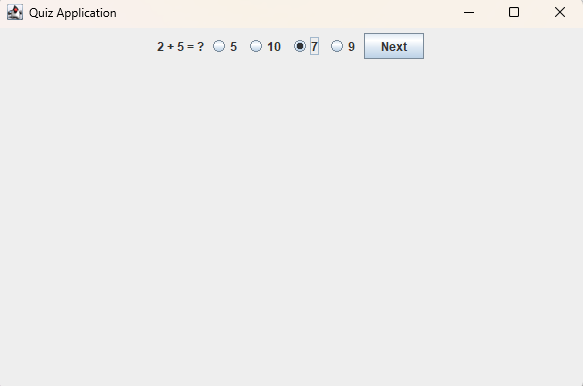

# ❓ Quiz Application

Приложение для прохождения тестов на Java Swing.

## ✨ Особенности

• ❓ Отображение вопросов  
• 🔘 Выбор вариантов ответа  
• 📊 Подсчёт баллов  
• 🏆 Отображение результата  

## 🚀 Быстрый запуск

1. Скачать проект  
2. Открыть в IntelliJ IDEA  
3. Запустить файл QuizApplication.java  
4. Использовать приложение  

## 📷 Скриншоты

## 🛠 Технологии

• Java  
• Java Swing  
• AWT  

